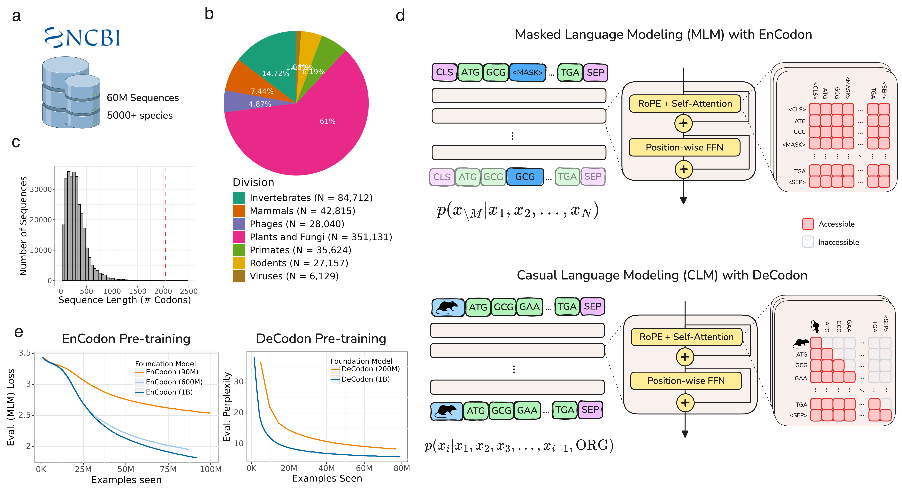

# Repository of Codon-based Foundation Models (EnCodon & DeCodon)

This repository contains the code for the EnCodon and DeCodon models, codon-resolution large language models pre-trained on the NCBI Genomes database described in the paper "[A Suite of Foundation Models Captures the Contextual Interplay Between Codons](#)". 

## Get started 🚀
### Installation
#### From source
Currently, this is the only way to install the package but will push a pip installable version soon. To install the package from source, run the following command:

```bash
pip install git+https://github.com/goodarzilab/cdsFM.git
```

<!-- #### From pip

```bash
pip install cdsFM
``` -->

### Usage
Now that you have cdsFM installed, you can fetch the pre-trained models and use it for your downstream in a number of possible options:

#### Sequence Embedding Extraction
Following is an example of how to use the EnCodon and DeCodon models to extract sequence embeddings:\

```python
from cdsFM import AutoEnCodon, AutoDeCodon

# Load your dataframe containing sequences
df = ...

# Load a pre-trained EnCodon model
model = AutoEnCodon.from_pretrained("goodarzilab/EnCodon-620M")

# Load a pre-trained DeCodon model
model = AutoDeCodon.from_pretrained("goodarzilab/DeCodon-200M")

# Extract embeddings
embeddings = model.extract_embeddings(df)
```

#### Sequence Generation with DeCodon
You can generate organism-specific coding sequences with DeCodon simply by:

```python
from cdsFM import AutoDeCodon

# Load a pre-trained DeCodon model
model = AutoDeCodon.from_pretrained("goodarzilab/DeCodon-200M")

# Generate!
sequences = model.generate(
    prompt=None,
    taxid=9606, # NCBI Taxonomy ID for Homo sapiens
    num_return_sequences=10, # Number of sequences to return
    max_length=1024, # Maximum length of the generated sequence
    temperature=0.1, # Temperature for controlling randomness
    top_k=50, # Top-k sampling
    batch_size=10, # Batch size for generation
    do_sample=True, # Enable sampling
    verbose=True, # Print progress
)

```

--- 
## Tokenization

EnCodon and DeCodon are pre-trained on coding sequences of length up to 2048 codons (i.e. 6144 nucleotides), including the
\<CLS> token prepended automatically to the beginning of the sequence and the \<SEP> token appended at the end. The tokenizer's vocabulary consists of 64 codons and 5 special tokens namely \<CLS>, \<SEP>, \<PAD>, \<MASK> and \<UNK>. 

---

## HuggingFace 🤗

A collection of pre-trained checkpoints of EnCodon & DeCodon models are available on [HuggingFace 🤗](https://huggingface.co/goodarzilab). Following table contains the list of available models:

| Model | name | num. params | description | weights |
| :--- | :---: | :---: | :---: | :---: |
| EnCodon | encodon-80M | 80M | Pre-trained checkpoint | [🤗](https://huggingface.co/goodarzilab/EnCodon-80M) |
| EnCodon | encodon-80M-euk | 80M | Eukaryotic-expert | [🤗](https://huggingface.co/goodarzilab/EnCodon-80M-euk) |
| EnCodon | encodon-620M | 620M | Pre-trained checkpoint | [🤗](https://huggingface.co/goodarzilab/EnCodon-620M) |
| EnCodon | encodon-620M-euk | 620M | Eukaryotic-expert | [🤗](https://huggingface.co/goodarzilab/EnCodon-620M-euk) |
| DeCodon | decodon-200M | 200M | Pre-trained checkpoint | [🤗](https://huggingface.co/goodarzilab/DeCodon-200M) |

---

## Citation

If you find this repository useful in your work, please add a relevant citation to
either of our associated papers:


[EnCodon & DeCodon paper](#):
```bibtex
```


